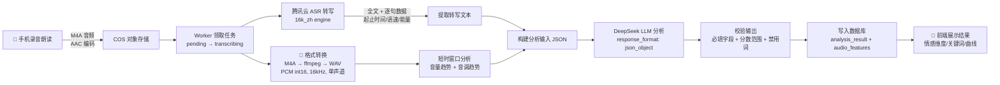

# 语音心理科研采集 App Demo

语音采集与实验性表达洞察演示系统。录音经 ASR 转写 + 本地声学特征提取后，由 DeepSeek LLM 生成非临床的情感状态预测。

> ⚠️ 实验性预测，仅供演示与自我观察，不构成医疗、心理诊断或人格测评。

## 下载地址

- **Android APK**：[app-release.apk](https://cloud1-0gys80m48da147a1-1304271127.tcloudbaseapp.com/app-release.apk)

## 图示

<table>
  <tr>
    <td></td>
    <td></td>
    <td></td>
  </tr>
  <tr>
    <td></td>
    <td></td>
    <td></td>
  </tr>
</table>

## 分析全流程



**关键：音频文件不出服务端**。ASR 转写 + 本地特征提取后，只把文本和结构化指标喂给 DeepSeek，AI 无法还原原始声音。

## 可靠性治理

- **分块断点续传上传**：App 端将录音分片上传，弱网或中断后可从断点恢复，不重录不重传已完成分片。
- **任务队列 + 异步 Worker**：上传完成后入队，后台 Worker 轮询领取执行，前端实时展示转录/分析进度。
- **自动重试机制**：ASR 或 LLM 调用失败时按指数退避自动重试（最多 3 次），Worker 宕机时租约过期自动回队。
- **声学特征链路**：M4A → ffmpeg 解码为 PCM → 250ms 短时窗口 → 自相关法估基频 + RMS 音量趋势，全程不落盘。
- **双曲线声学图表**：前端 React Native 绘制基线对齐的「音量 + 音调」时序曲线，标注动态范围与有声帧统计。

## AI 输入内容

AI 接收的是一个结构化 JSON，**不包含原始音频文件**：

| 类别 | 内容 | 来源 |
|---|---|---|
| **转写全文** | 完整文字 | 腾讯云 ASR |
| **录音时长** | audio_duration_ms | 腾讯云 ASR |
| **逐句数据** | 每句文本 + 起止时间 + 语速 + 情感能量 | 腾讯云 ASR |
| **句级统计** | 语速/能量的最小/最大/平均值 | 服务端聚合 |
| **音量特征** | average / peak / dynamic_range | 本地 Python + ffmpeg |
| **音调特征** | 有声帧数、平均 Hz、音高范围 | 本地 Python + ffmpeg |

## 处理链路说明

1. **格式转换**：ffmpeg 将 M4A (AAC) 解码为 WAV (PCM int16, 16kHz, 单声道)
2. **ASR 转写**：腾讯云 `flash/v1` 接口，`16k_zh` 引擎，返回全文 + 逐句时间戳/语速/情感能量
3. **本地特征提取**：250ms 短时窗口，计算 RMS 音量 (dBFS) + 自相关法估计基频 (F0)
4. **LLM 分析**：DeepSeek 接收结构化 JSON，输出 JSON 格式的情感预测

ASR 与本地特征在当前实现中是**串行执行**（同一 Worker 进程顺序处理）。

## AI 输出字段

| 字段 | 类型 | 说明 |
|---|---|---|
| `expression_state` | string | 整体表达状态描述 |
| `vitality_score` | int (0-100) | 活力指数 |
| `tension_score` | int (0-100) | 紧张度 |
| `emotion_dimensions` | object | valence / arousal / stability（中文描述） |
| `emotion_keywords` | string[] (2-3个) | 从固定词表中选取 |
| `evidence` | string[] | 仅引用输入中的转写/ASR/音频特征 |
| `summary` | string | 状态解读 |
| `suggestion` | string | 中性状态说明，非建议或干预 |
| `disclaimer` | string | 免责声明 |
| `audio_features` | object | 原始声学特征（附加上下文） |

`emotion_keywords` 可选词表：`积极, 平静, 兴奋, 紧张, 低活力, 低落, 波动, 稳定, 专注`

## 项目结构

```
├── apps/
│   ├── api/          # FastAPI 服务端 + Worker
│   │   └── app/
│   │       ├── main.py              # API 路由
│   │       ├── worker.py            # 后台任务 Worker
│   │       ├── analysis_services.py # ASR / 特征提取 / DeepSeek
│   │       ├── models.py            # SQLAlchemy 模型
│   │       └── cos_storage.py       # 对象存储封装
│   └── mobile/       # React Native 采集端 App
│       ├── App.tsx
│       └── src/
│           ├── components/
│           ├── services/
│           └── config/
└── db/migrations/    # 数据库迁移
```

## 数据模型

- **CollectionRecord**：录制片段主记录（匿名编号/元数据/转写/分析结果）
- **AnalysisTask**：分析任务状态机（pending → transcribing → analyzing → completed/failed）
- **UploadSession**：分块上传会话（断点续传）
