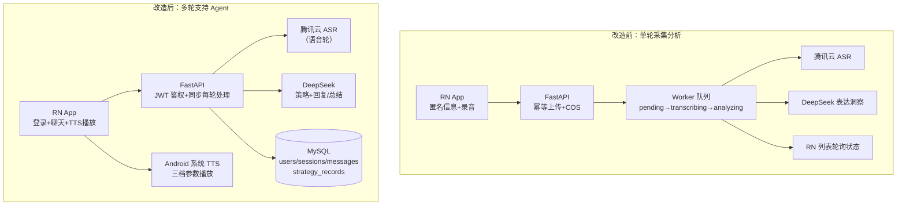

# 焦虑人群语音心理支持 Agent · 改造文档

> 记录从 `voice-psychology-research-demo`（语音采集与表达洞察 Demo）到「焦虑人群语音心理支持 Agent」的改造：原有功能、复用部分、新增/修改/删除内容与实施步骤。系统设计见《[焦虑支持Agent-设计文档](./焦虑支持Agent-设计文档.md)》。

## 目录

- 1. 摘要与关键结论
  - 1.1 改造结论总览
  - 1.2 改造前后架构对比
- 2. 原项目功能盘点
- 3. 复用清单
- 4. 新增清单
- 5. 修改与删除清单
- 6. 实施步骤
- 7. 交付物与验收对照

## 1. 摘要与关键结论

在原仓库新分支（已建）上实施改造：**保留** FastAPI 服务骨架、腾讯云 ASR 调用、DeepSeek 结构化调用与校验骨架、yoyo 迁移体系、RN 工程与录音能力；**移除**单轮采集分析的业务面（Worker 队列、COS 断点续传、录音列表/详情页、旧三张数据表）；**新增**账户体系（JWT + bcrypt）、多轮会话与消息模型、每轮策略流水线（安全规则 + LLM + Pydantic 校验）、TTS 三档播放、会话总结与 5 项必做测试。目标形态为本地可运行 + Android 真机演示。

### 1.1 改造结论总览

| 类别 | 内容 | 说明 |
| --- | --- | --- |
| 原有功能 | 录音上传→ASR→LLM 单轮表达洞察分析、匿名采集、Worker 异步队列、COS 存储 | 见第 2 章 |
| 复用 | FastAPI 骨架、ASR 调用、DeepSeek 调用+JSON 校验骨架、SQLAlchemy+yoyo、RN 录音/HTTP 层、cmd.sh | 见第 3 章 |
| 新增 | 账户/会话/消息/策略记录四表与接口、安全词表与固定文案、策略 Prompt、TTS 服务、聊天 UI、总结、测试 | 见第 4 章 |
| 修改/删除 | main.py 路由重写、models.py 重写、App.tsx 重写、worker/cos_storage 删除、旧表 drop 迁移 | 见第 5 章 |

### 1.2 改造前后架构对比

关键结构变化：异步 Worker 队列取消（轮次式交互同步响应）；外部云依赖从 3 个（COS/ASR/DeepSeek）减为 2 个（ASR/DeepSeek），音频落本地磁盘；新增鉴权层与 Android 端 TTS 播放链路。

## 2. 原项目功能盘点

| 原有功能 | 实现位置 | 本期去向 |
| --- | --- | --- |
| 匿名基础信息 + 录音上传（幂等） | `App.tsx`、`src/services/` | 砍（被登录 + 聊天语音输入替代） |
| COS 分块断点续传 | `src/services/resumableUpload.ts`、`cos_storage.py` | 砍（音频 multipart 直传本地磁盘） |
| Worker 任务队列（状态机/租约/退避重试） | `worker.py` | 砍（同步处理；`worker.py` 删除） |
| 腾讯云 ASR flash/v1 签名调用 | `analysis_services.py::transcribe_m4a` | **复用**（语音轮转写 + 副语言特征） |
| DeepSeek 调用 + JSON 输出校验骨架 | `analysis_services.py` | **复用骨架**（Prompt 与输出 Schema 重写） |
| 声学特征提取（ffmpeg→PCM→F0/RMS） | `analysis_services.py` | 部分复用（语音信号补充，非必须） |
| 录音列表/详情/重试/取消 UI | `App.tsx`、`RecordManagement.tsx` | 砍（聊天页 + 历史会话列表替代） |
| FastAPI + SQLAlchemy + yoyo 迁移 | `main.py`、`models.py`、`db/migrations/` | **复用骨架**（模型与路由重写） |
| RN 录音（`react-native-audio-recorder-player`） | `src/services/recorder.ts` | **复用**（聊天语音输入） |

## 3. 复用清单（不改或基本不改）

| 资产 | 文件 | 复用方式 |
| --- | --- | --- |
| ASR 调用（签名、错误分类、超时） | `apps/api/app/analysis_services.py::transcribe_m4a` 及其依赖的 `config.py` 变量 | 原样调用；新增对句级特征的提取包装 |
| DeepSeek 调用骨架（`json_object`、错误处理） | `analysis_services.py` 中 DeepSeek 部分 | 抽出为通用 `call_deepseek_json(prompt, schema_desc)`，原表达洞察 Prompt 移除 |
| FastAPI 应用与 CORS、`/api/health` | `app/main.py` 头部 | 保留应用实例，路由表重写 |
| SQLAlchemy engine/session、`get_db` | `app/database.py` | 原样 |
| yoyo 迁移流程与 `cmd.sh db:migrate` | `db/migrations/`、`cmd.sh` | 追加新迁移文件 |
| RN 录音服务 | `src/services/recorder.ts` | 原样（聊天页按住录音调用） |
| axios 封装 + AsyncStorage | `src/services/api.ts` | 复用并加 JWT 拦截器 |
| `cmd.sh` api/mobile/apk 子命令 | `cmd.sh` | 保留；worker 子命令移除 |
| `.env` 配置体系 | `apps/api/.env` | 保留 ASR/DeepSeek 变量；COS 变量移除，新增 `JWT_SECRET` |

## 4. 新增清单

### 服务端（`apps/api/app/`）

| 新增 | 内容 |
| --- | --- |
| `auth.py` | JWT 签发/校验、bcrypt 密码校验、`get_current_user` 依赖注入（新依赖：`bcrypt` 已装、`pyjwt`） |
| `schemas.py` | Pydantic 模型：策略记录（枚举/observed_signals 非空）、回复约束、总结输出、请求体 |
| `safety.py` | 确定性安全词表（high/ambiguous 两档）、固定安全文案、固定安全确认问题 |
| `strategy.py` | 每轮流水线编排：输入→安全规则→DeepSeek 调用→校验重试→voice_profile 确定性推导→TTS 参数→落库 |
| `rejection.py` | 方法拒绝正则检测 + 会话内拒绝列表维护 |
| `summary.py` | 会话总结生成（DeepSeek + Pydantic 校验） |
| `tts_profiles.py` | 三档 voice_profile → rate/pitch/停顿参数常量映射 |
| `seed.sql`（交付物） | 测试账号注入 SQL（bcrypt 哈希已生成） |
| `tests/` | 5 项必做测试（设计文档第 10 章） |

### 数据库（`db/migrations/` 新迁移）

| 迁移 | 内容 |
| --- | --- |
| `*_drop_legacy_tables.sql` | drop `collection_records` / `analysis_tasks` / `upload_sessions` |
| `*_create_agent_tables.sql` | 建 `users` / `sessions` / `messages` / `strategy_records`（字段见设计文档第 5 章） |

### 移动端（`apps/mobile/src/`）

| 新增 | 内容 |
| --- | --- |
| `screens/LoginScreen.tsx` | 登录（新依赖：`react-native-tts`） |
| `screens/NewSessionScreen.tsx` | 创建会话 + 三项偏好 |
| `screens/ChatScreen.tsx` | 消息流、文字/语音输入、TTS 播放、结束会话 |
| `screens/HistoryScreen.tsx` | 历史会话列表 + 只读详情 |
| `screens/SummaryScreen.tsx` | 会话总结展示 |
| `components/StrategyPanel.tsx` | 策略观察面板（设计文档第 9 章） |
| `components/MessageBubble.tsx` | 消息气泡（用户语音可重播） |
| `services/tts.ts` | `react-native-tts` 封装：按档案参数播放、按句分段插入停顿、引擎自检 |

## 5. 修改与删除清单

| 文件/模块 | 动作 | 说明 |
| --- | --- | --- |
| `app/models.py` | 重写 | 四张新表模型；旧三模型删除 |
| `app/main.py` | 重写 | 新路由表（设计文档第 8 章）；旧 record/upload/task 路由删除 |
| `app/config.py` | 修改 | 删 COS 变量；新增 `JWT_SECRET`；Worker 变量删除 |
| `app/worker.py`、`app/cos_storage.py` | 删除 | Worker 队列与 COS 存储不再使用 |
| `app/analysis_services.py` | 修改 | 拆出通用 DeepSeek 调用；删表达洞察专有 Prompt/校验；保留 ASR |
| `pyproject.toml` | 修改 | 依赖：+`bcrypt`、+`pyjwt`；-`cos-python-sdk-v5` |
| `App.tsx` | 重写 | 导航结构：登录→会话创建→聊天→总结/历史 |
| `src/components/RecordManagement.tsx`、`ApiEnvironmentSelector.tsx` | 删除 | 旧功能与环境切换砍除，API 地址固定本地收进 `src/config/api.ts` |
| `src/services/resumableUpload.ts` | 删除 | 断点续传砍除 |
| `cmd.sh` | 修改 | 移除 `worker` 子命令与 yoyo MySQL URL 转换中不再需要的部分 |
| `docker-compose.prod.yml`、`apps/api/Dockerfile` | 保留不动 | 本地运行不依赖；不作为本期交付路径 |
| `README.md` | 重写 | 交付物要求：启动方式、架构、数据模型、策略依据、安全边界、已知限制、复用清单、测试结果、演示记录 |
| `apps/mobile/__tests__/App.test.tsx` | 重写/删除 | 旧 App 结构测试失效，随新页面补轻量渲染测试（非必做） |

## 6. 实施步骤

按依赖顺序分六步，每步结束可独立验证：

1. **数据层**：新迁移（drop 旧表 + 建新表）→ `models.py` 重写 → `cmd.sh db:migrate` 验证 → 执行测试账号 SQL → 手查 `users` 表。
2. **鉴权**：`config.py` + `auth.py` + `/api/auth/*` 路由 → curl 验证登录/错误密码 401/无 token 401 → 删除/越权行为在步骤 4 一并验证。
3. **会话与消息骨架**：sessions CRUD + messages 只读接口（不含 LLM）→ 越权 404 手验（demo1/demo2 双 token）。
4. **每轮流水线（核心）**：`safety.py` → `schemas.py` → DeepSeek 通用调用 → `strategy.py` 编排 → `POST /api/sessions/{id}/messages` 文字版跑通 → `rejection.py` → 语音版（ASR + multipart）→ 5 项服务端测试落地并跑绿。
5. **移动端**：`react-native-tts` 安装 + `tts.ts` → 登录/创建/聊天/历史/总结五屏 + StrategyPanel → 真机联调（TTS 引擎自检、三档参数听感调校并固化常量、录音→ASR→回复全链路）。
6. **收尾交付**：README 重写 → `cmd.sh` 清理 → 按验收演示 8 场景录运行记录/截图 → 复用清单核对。

每步验证不通过不进入下一步；LLM 相关行为以真实调用结果为准，不编造测试数据。

## 7. 交付物与验收对照

| 题目交付物 | 对应内容 | 状态 |
| --- | --- | --- |
| 可运行的前后端源码 | `apps/api` + `apps/mobile`（新分支） | 待实施 |
| 数据库初始化/迁移脚本 | yoyo 迁移 ×2 + 测试账号 SQL | 待实施 |
| README（启动/架构/数据模型/策略依据/安全边界/已知限制） | README 重写（实施步骤 6） | 待实施 |
| 原项目复用与新增/修改清单 | 本文档第 2~5 章 | 已交付 |
| ≥5 个规定测试及运行结果 | `apps/api/tests/`（设计文档第 10 章） | 待实施 |
| 验收场景运行记录/截图 | 演示 8 场景（设计文档第 1.1 章测试行对应） | 待演示准备 |

验收演示 8 场景与设计的对应关系：一般焦虑→路径 A 约束；明显紧张→calm_slow 实际参数；偏好记忆→`rejected_techniques`；模糊风险→安全确认；高风险→固定分流；越权→404；历史与总结→持久化；自动化测试→现场跑 pytest。
