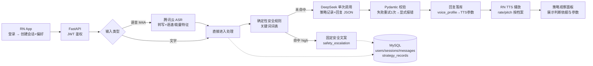

# 焦虑人群语音心理支持 Agent · 设计文档

> 基于既有 `voice-psychology-research-demo` 改造的 AI 心理支持 Agent 系统设计。本文覆盖题目全部必做点，配套文档见《[焦虑支持Agent-改造文档](./焦虑支持Agent-改造文档.md)》。
>
> **产品边界**：非医疗性质的辅助性心理支持工具，不作诊断、不作治疗承诺、不替代心理咨询师与紧急援助服务。

## 目录

- 1. 摘要与关键结论
  - 1.1 本期结论
  - 1.2 端到端链路
- 2. 背景、目标与范围
- 3. 产品闭环与页面设计
- 4. 系统架构
- 5. 数据模型
- 6. 每轮处理流水线（核心设计）
  - 6.1 输入与语音信号
  - 6.2 三层安全防线
  - 6.3 LLM 策略调用与 Schema 校验
  - 6.4 四条支持路径
  - 6.5 语音档案与 TTS 参数
  - 6.6 方法拒绝的记忆与避开
- 7. 会话总结
- 8. API 设计
- 9. 策略观察面板
- 10. 测试计划
- 11. 边界、风险与待确认项

## 1. 摘要与关键结论

在既有「录音 → 腾讯云 ASR → DeepSeek 结构化分析」单轮采集系统上，改造为**多轮对话式心理支持 Agent**：用户登录后以文字或语音交流，服务端每轮先经过**确定性安全规则 + LLM 结构化判断**评估焦虑程度与风险等级，再选择四条支持路径之一生成简短回复，按「安全 > 状态 > 偏好 > 默认」优先级选定语音档案，交由 Android 系统 TTS 以可验证的不同参数播放；会话结束后同步生成总结。账户体系（JWT + bcrypt）、会话与消息持久化、方法拒绝记忆为全新模块；ASR 与 LLM 调用链路复用原项目。

### 1.1 本期结论

| 维度 | 关键结论 | 依据、影响与边界 |
| --- | --- | --- |
| 前端 | 保留 React Native App（真机演示），新增登录/创建会话/聊天/总结页 | 题目允许 Web 或 RN 二选一；录音与 HTTP 层复用原项目 |
| 账户 | JWT Bearer + bcrypt 哈希；两个测试账号 `demo1`/`demo2`（密码 `Passw0rd!`） | 题目必做点 1：密码不明文、服务端强制鉴权、数据隔离 |
| 数据库 | 本地 MySQL（沿用）+ yoyo 新迁移建表；旧三表 drop | 演示形态本地可运行，不部署线上 |
| 语音输入 | 聊天接口 multipart 直传音频，服务端同步调腾讯云 ASR（复用原实现） | 轮次式交互需同步响应；原 Worker 异步队列与断点续传废弃 |
| LLM 链路 | 单次 DeepSeek 调用同时输出「策略记录 + 回复文字」，Pydantic 严格校验 | 题目必做点 4：字段缺失/枚举非法不得进入正常流程 |
| 安全 | 三层防线：确定性关键词规则 → LLM 结构化判断 → 校验失败兜底；high 直接返回固定安全文案并跳过 LLM | 题目必做点 5：安全判断不得完全交给普通对话 Prompt |
| TTS | `react-native-tts` 调 Android 系统引擎；三档档案（calm_slow / warm_normal / concise_direct）真实下发不同 rate/pitch，参数每轮回传服务端落库 | 题目必做点 6：参数可验证、仅改标签不算完成 |
| 拒绝记忆 | 正则 + LLM 标记双通道检测，会话内不再重复被拒方法 | 题目必做点 7 |
| 总结 | 结束会话时同步调 DeepSeek 生成，落库可复查 | 题目必做点 8：不得编造未表达的事实 |
| 测试 | pytest + FastAPI TestClient 共 5 项；策略类测试真实调 DeepSeek | 题目第四节：≥3 个可运行服务端测试，安全分流/鉴权不 Mock |

### 1.2 端到端链路



## 2. 背景、目标与范围

### 已知背景

- 原项目 `voice-psychology-research-demo`：RN 0.87.1 bare 工程 + FastAPI + MySQL，实现「录音上传 → 腾讯云 ASR flash/v1 转写 → DeepSeek JSON 结构化分析（带字段校验）」的单轮采集分析闭环。
- 可复用资产：ASR 签名调用与错误分类（`analysis_services.py`）、DeepSeek `response_format: json_object` 调用与校验骨架、SQLAlchemy + yoyo 迁移体系、RN 录音与 HTTP 服务层、`cmd.sh` 启动脚本。
- 题目允许复用自有项目，但要求列出原有功能、复用部分、新增/修改内容清单（见改造文档）。

### 目标

1. 完成题目规定的产品闭环：登录 → 创建会话与偏好 → 文字/语音输入 → 状态与风险判断 → 支持策略选择 → 文字回复 → 自适应语音播放 → 保存上下文 → 结束会话 → 生成并查看总结。
2. 全部 9 项必做功能 + 5 项必做测试落地，可现场演示 8 个验收场景。
3. 安全分流、账户鉴权与数据隔离为不可降级项。

### 非目标

- 不做实时双工语音、流式 ASR/LLM、打断、长时间连续录音（题目明确不要求）。
- 不做注册、邮箱验证、找回密码、第三方登录、后台权限系统。
- 不部署公网，本地可运行即可；不考察复杂视觉设计。
- 不实现完整心理量表（GAD-7 为加分项，本期暂不做）。

## 3. 产品闭环与页面设计

```text
登录页
→ 会话创建页（主要困扰 / 表达偏好 / 是否语音回复）
→ 聊天页（文字输入 + 语音录制/上传 + TTS 播放 + 策略观察面板）
→ 结束会话 → 总结页
→ 历史会话列表（重新登录后可查看）
```

| 页面 | 主要内容 | 用户动作与规则 |
| --- | --- | --- |
| 登录 | 用户名 + 密码 | 调 `POST /api/auth/login` 获取 JWT 存 AsyncStorage；退出登录清除本地 token |
| 会话创建 | 当前主要困扰（工作/学习/人际关系等）、期望表达方式（温和陪伴/简洁直接）、是否播放语音回复 | 三项均为必选，随会话持久化并注入每轮 Prompt |
| 聊天 | 消息流（用户/助手）、文字输入框、按住录音按钮、语音消息可播放、Agent 回复旁的 TTS 播放按钮、策略观察面板（见第 9 章）、结束会话按钮 | 同一会话支持 ≥5 轮；`voice_reply_enabled=false` 时不自动播放，仅提供手动播放按钮 |
| 总结页 | 本次困扰、关键感受、用过的策略、被拒方法、下一步行动、风险级别与是否触发安全分流、非诊断声明 | 结束会话后同步生成；重新登录可从历史会话再次查看 |
| 历史列表 | 该用户全部会话（含已结束），点击进入只读聊天记录或总结 | 服务端按 `user_id` 过滤，越权访问返回 404 |

## 4. 系统架构

| 组件 | 职责 | 不负责 |
| --- | --- | --- |
| RN App | 登录态管理、录音/播放、聊天 UI、TTS 播放与参数回传、策略面板展示 | 不持有任何云密钥，不直接调 ASR/DeepSeek |
| FastAPI | JWT 鉴权、会话/消息 CRUD、每轮处理编排（安全规则→LLM→校验→落库）、总结生成、静态音频文件服务 | 不做公网部署 |
| MySQL | users / sessions / messages / strategy_records 四张新表 | 旧三表（drop 迁移移除） |
| 腾讯云 ASR | 语音转文字 + 句级语速/情感能量等副语言特征 | 不产生心理结论 |
| DeepSeek | 每轮输出「策略记录 + 回复」结构化 JSON；会话结束输出总结 JSON | 安全规则命中 high 时不被调用；不做诊断 |
| Android 系统 TTS | 按档案参数播放回复 | 不联网，本地引擎 |

所有会话/消息接口均要求请求头携带 `Authorization: Bearer <jwt>`；查询一律以 `session.user_id == current_user.id` 为过滤条件，未命中返回 404（不泄露存在性）。

## 5. 数据模型

新增四张表（yoyo 迁移 `db/migrations/2026xxxx_*__create_agent_tables.sql`，另一条迁移 drop 旧三表）：

| 表 | 关键字段 | 说明 |
| --- | --- | --- |
| `users` | `id` PK, `username` UNIQUE, `password_hash`(bcrypt), `created_at` | 测试账号经 SQL 手动注入；密码不明文 |
| `sessions` | `id` PK, `user_id` FK, `concern`(主要困扰), `expression_preference`('gentle'\|'concise'), `voice_reply_enabled` BOOL, `rejected_techniques` JSON(默认`[]`), `status`('active'\|'ended'), `max_risk_level`('normal'), `safety_triggered` BOOL, `summary` JSON(可空), `created_at`, `ended_at` | 会话偏好与拒绝记忆的载体 |
| `messages` | `id` PK, `session_id` FK, `role`('user'\|'assistant'), `content` TEXT, `audio_path`(可空，本地文件相对路径), `asr_features` JSON(可空), `created_at` | 用户语音消息存 ASR 副语言特征供策略判断 |
| `strategy_records` | `id` PK, `session_id` FK, `message_id` FK(assistant 消息), `anxiety_level`, `risk_level`, `observed_signals` JSON, `support_goal`, `technique`, `technique_reason`, `response_constraints` JSON, `voice_profile`, `tts_params` JSON(实际下发参数), `avoided_techniques` JSON(本轮避开及原因), `is_safety_escalation` BOOL, `source`('rule'\|'llm'), `created_at` | 每轮一份，Schema 校验后的权威记录 |

枚举取值与题目一致：`anxiety_level ∈ {low, moderate, high, uncertain}`；`risk_level ∈ {normal, ambiguous, high}`；`technique ∈ {validation, clarification, grounding, reframing, action_planning, safety_escalation}`；`voice_profile ∈ {calm_slow, warm_normal, concise_direct}`。

## 6. 每轮处理流水线（核心设计）

`POST /api/sessions/{id}/messages`（JSON 文字 或 multipart 音频）内部按以下顺序执行：

### 6.1 输入与语音信号

- 文字输入：直接进入 6.2。
- 语音输入：M4A 保存至服务端本地 `apps/api/upload_audio/`（按 session 分目录），同步调用腾讯云 ASR flash/v1（复用原 `transcribe_m4a`）；除转写文本外，提取句级 `speech_speed` / `emotional_energy` 聚合值存入 `asr_features`，随 Prompt 一并交给 LLM（对应题目「传递的信息可不仅限于文字」）。ASR 配置缺失或调用失败时返回明确错误码，不伪装成功。
- 低置信度二次确认为加分项，本期不做；ASR 返回空转写时报错提示用户重试。

### 6.2 三层安全防线

**第 1 层（确定性规则，LLM 之前，纯函数）**：服务端维护两档关键词词表（含变体，中文优先）：

- `high`：自杀、自伤、不想活、轻生、结束生命等明确自伤/自杀表述，或要求提供药物剂量/停药方案；
- `ambiguous`：觉得活着没意思、撑不下去、消失等模糊表述。

命中 `high` → **完全跳过 LLM**，直接返回固定安全文案（内容见下），落库 `technique='safety_escalation'`、`source='rule'`、`is_safety_escalation=true`，`sessions.max_risk_level` 升级为 high。命中 `ambiguous` → 本轮强制走安全确认问题（固定短文案 + 一次直接询问），同样不进入普通支持策略。

固定安全文案按题目五要素组织：说明 AI 能力边界不作诊断 / 鼓励联系专业人员 / 紧急风险建议立即联系当地紧急服务或可信赖的人 / 不提供药物剂量与保证性承诺 / 语气温和不吓人。文案常量置于服务端代码，评审可查。

**第 2 层（LLM 结构化判断）**：规则未命中时，LLM 输出的 `risk_level` 允许把风险升级为 ambiguous/high（如用户用规则词表未覆盖的表达描述风险）。升级为 high 时同样走固定安全文案兜底（LLM 只负责识别，不负责生成安全响应正文）。

**第 3 层（兜底）**：LLM 输出校验失败、重试后仍失败或外部服务异常时——若本轮文本命中过 ambiguous 词表或 LLM 曾输出非 normal 风险，按 ambiguous 处理并发出安全确认；否则该轮显式报错（HTTP 502 + 明确错误信息），不静默降级、不返回编造的回复。

### 6.3 LLM 策略调用与 Schema 校验

单次 DeepSeek 调用（`response_format: json_object`，复用原调用骨架），Prompt 注入：

1. 系统角色与产品边界声明（非医疗、禁诊断用语、禁保证性承诺）；
2. 会话偏好：主要困扰、表达方式偏好、`rejected_techniques` 列表（明确要求本轮不得选用）；
3. 历史上下文：最近 N 轮（含每轮 technique）消息摘要；
4. 本轮用户输入：文字 + （若有）语音副语言特征；
5. 输出 Schema 说明（字段、枚举、`observed_signals` 必须引用用户实际表达、回复须遵守 `response_constraints`）。

期望输出 JSON：

```json
{
  "anxiety_level": "low | moderate | high | uncertain",
  "risk_level": "normal | ambiguous | high",
  "observed_signals": ["仅引用用户实际表达中的证据"],
  "support_goal": "本轮希望达成的目标",
  "technique": "validation | clarification | grounding | reframing | action_planning | safety_escalation",
  "technique_reason": "选择该策略的简明、可审计理由",
  "response_constraints": {"max_sentences": 3, "ask_one_question_only": true},
  "voice_profile": "calm_slow | warm_normal | concise_direct",
  "reply_text": "回复正文",
  "user_rejected_technique": "null 或本轮检测到用户拒绝的方法枚举"
}
```

服务端用 **Pydantic 模型**校验：枚举值、类型、`observed_signals` 非空字符串数组、`reply_text` 非空。校验失败自动重试一次（附上错误说明要求纠正）；仍失败则按 6.2 第 3 层兜底。回复发出前再按 `response_constraints` 做事后校验（句数上限、问号数量），超限按约束截断或要求重试一次。**任何不合法输出都不得进入正常业务流程。**

### 6.4 四条支持路径

| 路径 | technique 映射 | 适用 | 关键约束（写入 Prompt） |
| --- | --- | --- | --- |
| A 情绪确认与澄清 | `validation` / `clarification` | 一般担忧、可正常沟通 | 承认感受 + 询问具体诱因；不立即输出大段通用建议 |
| B 即时稳定 | `grounding` | 明显紧张、心跳加快、思绪混乱 | 短句、一次只给一个简单步骤；可给 grounding/呼吸引导但**不得强迫** |
| C 认知与行动整理 | `reframing` / `action_planning` | 需要区分事实/推测/可控事项 | 一至两个现实可行小步骤；不得保证有效 |
| D 安全分流 | `safety_escalation` | 自伤/自杀风险、要求诊断/剂量/停药 | 固定文案，跳过普通流程 |

策略方法学依据（写入 README）：支持性倾听（validation）、澄清式提问（clarification）、grounding 技术（5-4-3-2-1 感官定位、呼吸引导）、CBT 认知重构与行为激活（reframing / action_planning）；适用边界为非医疗辅助支持。

### 6.5 语音档案与 TTS 参数

选择优先级：**安全要求 > 当前状态 > 用户表达偏好 > 默认设置**。具体规则：

1. `safety_escalation` 轮 → 固定 `calm_slow`（稳定、慢、柔和——安全优先级最高）；
2. `anxiety_level = high` → `calm_slow`（题目要求：明显紧张时较慢语速、更长停顿、较短回复）；
3. `anxiety_level = moderate` 或 `uncertain` → `warm_normal`；用户偏好 concise 时可取 `concise_direct`（状态优先于偏好，moderate 用户偏好直接表达时允许 concise）；
4. `anxiety_level = low` 且偏好 concise → `concise_direct`；否则 `warm_normal`。

> 注：voice_profile 由服务端按上述规则**确定性推导**（不直接采信 LLM 输出的 voice_profile，LLM 字段仅作参考），保证优先级规则可测试、可审计。

三档实际 TTS 参数（`react-native-tts`，`rate`/`pitch` 为该库真实参数；数值为建议初始值，演示前真机调校后固化进常量）：

| 档案 | rate | pitch | 句间停顿 | 适用 |
| --- | --- | --- | --- | --- |
| `calm_slow` | 0.7 | 0.9 | 800ms（按句分段 speak） | 明显紧张 / 安全轮 |
| `warm_normal` | 1.0 | 1.0 | 400ms | 一般焦虑 |
| `concise_direct` | 1.15 | 1.0 | 200ms | 状态稳定且偏好直接 |

App 端每轮播放后（或播放指令下发时）把**实际使用的参数**随策略确认回传（或在消息响应中即包含服务端下发的参数，App 原样执行并回显），`tts_params` 落库 `strategy_records`，策略面板展示——满足「每轮记录并展示实际传给 TTS 的参数」「仅修改页面标签但参数相同不算完成」。

### 6.6 方法拒绝的记忆与避开

双通道检测（任一命中即生效）：

- **正则通道**：`"不喜欢|别再做|不要再|换一种"` + 方法名关键词（`呼吸|grounding|稳定练习` 等）的组合模式；
- **LLM 通道**：输出字段 `user_rejected_technique` 给出枚举值。

生效后：追加到 `sessions.rejected_techniques`；后续每轮 Prompt 注入该列表并明确禁止选用；服务端在收到 LLM 结果后**二次校验** `technique` 是否撞上被拒列表，撞上则重试一次，仍撞上则按兜底路径处理。策略面板展示 `avoided_techniques`（本轮避开了什么及原因）。

## 7. 会话总结

`POST /api/sessions/{id}/end` 同步调 DeepSeek（复用调用骨架），输入为：会话偏好 + 全部消息 + 每轮 strategy_records 摘要 + rejected_techniques。输出 JSON 经 Pydantic 校验后存 `sessions.summary` 并返回：

```json
{
  "main_concern": "本次主要困扰",
  "key_feelings": ["用户实际提到的感受或身体反应"],
  "techniques_used": ["本次采用过的支持策略"],
  "rejected_methods": ["用户明确拒绝的方法"],
  "agreed_next_step": "双方确认的下一步行动（无则注明未确认）",
  "risk_level": "normal | ambiguous | high",
  "safety_escalation_triggered": false,
  "disclaimer": "非诊断声明（固定文案）"
}
```

Prompt 明确要求：所有内容仅可引用会话中真实出现过的表达与确认过的行动，缺失项如实标注（如 `agreed_next_step` 为「本次会话未确认下一步行动」），**不得凭空补充**。总结生成失败时显式报错并允许重试（重新点击结束/生成），不落半成品。

## 8. API 设计

| 方法与路径 | 请求 | 响应 | 鉴权 | 规则 |
| --- | --- | --- | --- | --- |
| `POST /api/auth/login` | `{username, password}` | `{token, username}` | 无 | 校验 bcrypt；失败 401 明确提示 |
| `POST /api/auth/logout` | — | `{ok}` | 是 | 服务端 JWT 无状态，App 清除本地 token；接口保留以语义完整 |
| `GET /api/auth/me` | — | `{id, username}` | 是 | 校验 token 有效性 |
| `POST /api/sessions` | `{concern, expression_preference, voice_reply_enabled}` | 会话对象 | 是 | 枚举校验 |
| `GET /api/sessions` | — | 本用户会话列表（含状态、风险级别摘要） | 是 | 强制 `user_id` 过滤 |
| `GET /api/sessions/{id}` | — | 会话详情 + 全部消息 + 每轮策略记录 + 总结（若有） | 是 | 越权返回 404 |
| `POST /api/sessions/{id}/messages` | JSON `{text}` 或 multipart `audio` | `{user_message, assistant_message, strategy_record}` | 是 | 核心轮次接口（第 6 章流水线）；仅 active 会话可发 |
| `POST /api/sessions/{id}/end` | — | `{summary}` | 是 | 幂等：已结束会话直接返回已有总结 |
| `DELETE /api/sessions/{id}` | — | `{ok}` | 是 | 删除消息、策略记录、本地音频文件与行记录（加分项） |

## 9. 策略观察面板

聊天页固定展开的轻量面板（可折叠），每轮刷新，数据来自最新 `strategy_records`：

- `anxiety_level` 与 `risk_level`（带颜色标识）；
- `observed_signals` 列表；
- 本轮 `technique`、`support_goal`、`technique_reason`；
- 当前 `voice_profile` 与实际 TTS 参数（rate/pitch/停顿）；
- 是否触发安全确认 / 安全分流（显式标记）；
- 本轮避开的方法及原因（`avoided_techniques`）。

仅展示简明决策依据，不展示模型原始 Chain of Thought（符合题目要求）。

## 10. 测试计划

pytest + FastAPI TestClient，位于 `apps/api/tests/`；测试前自动跑 yoyo 迁移 + 注入测试账号（复用交付的 SQL 哈希）。策略类测试真实调用 DeepSeek（题目允许联网），断言结构与行为、不断言具体文案：

| # | 测试 | 断言要点 | LLM |
| --- | --- | --- | --- |
| 1 | 普通焦虑输入选择正常支持策略 | `technique ∈ {validation, clarification, reframing, action_planning}`，`risk_level=normal`，Schema 校验通过，`observed_signals` 非空 | 真实调用 |
| 2 | 模糊风险输入进入安全确认 | 命中 ambiguous 词表 → 回复为安全确认问题、不输出一般建议；或 LLM 升级 ambiguous 同样生效 | 真实调用 + 规则 |
| 3 | 明确高风险必进 safety_escalation | 命中 high 词表 → **不调用 LLM**（可断言请求计数为 0）、`technique=safety_escalation`、固定文案五要素在场 | 不经过 LLM |
| 4 | 拒绝方法后不再选用 | 第 1 轮触发拒绝（正则或 LLM）→ `rejected_techniques` 含该方法；第 2 轮 `technique` 不等于该方法、`avoided_techniques` 有说明 | 真实调用 |
| 5 | 账户 A 无法读取账户 B 的会话 | demo1 创建会话后，demo2 token 访问 `GET /api/sessions/{id}` 返回 404；消息接口同样 404 | 不涉及 |

## 11. 边界、风险与待确认项

| 项目 | 结论 / 计划 | 状态 |
| --- | --- | --- |
| DeepSeek 输出稳定性 | 校验失败重试 1 次；仍失败显式报错，不降级伪装 | 设计已定，实际拒答率待联调观察 |
| 中文 TTS 引擎 | 演示真机需自带中文 TTS 引擎；App 启动时自检 `react-native-tts` 引擎可用性并提示 | 待真机确认（多数国产 ROM 自带） |
| TTS 参数档位 | 三档 rate/pitch/停顿为建议初始值，演示前真机调校后固化为常量 | 待调校 |
| 副语言特征 | 依赖腾讯 ASR flash/v1 句级 `speech_speed`/`emotional_energy` 实际返回；缺失时降级为纯文本判断并在面板注明 | 待真实响应确认 |
| 上下文长度 | 每轮 Prompt 仅注入最近 N 轮（初始 N=10）+ 会话级摘要，避免长会话 token 膨胀 | 待联调确定 N |
| 安全词表完备性 | 确定性规则是防线而非全集，第 2 层 LLM 判断兜语义变体；词表以常量维护便于评审与扩展 | 已定 |
| 加分项 | 会话删除（已纳入设计）、GAD-7、ASR 低置信度确认、反馈标记、用户编辑语音风格、日志脱敏 | 本期不做，接口预留不阻塞 |
