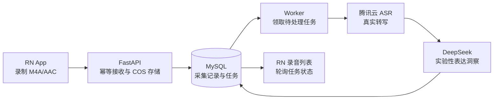
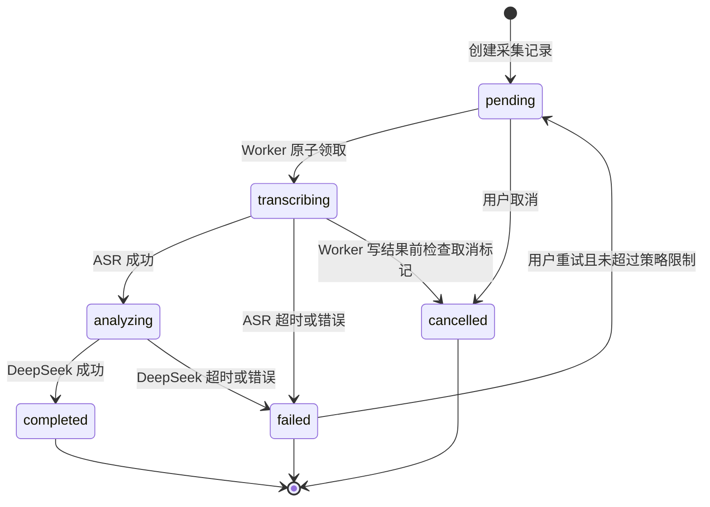
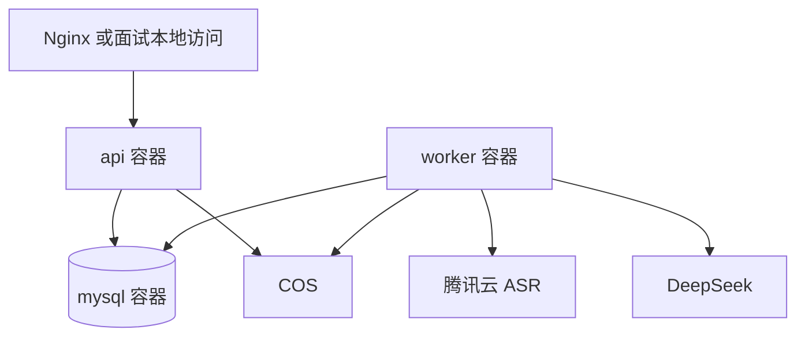

# 语音表达洞察采集 App Demo：设计与技术方案

> 用途：后天面试演示的 React Native + FastAPI 工程 Demo。用户录制一段普通话音频，服务端持久化原音频，并通过腾讯云 ASR 获取真实转写，再调用 DeepSeek 生成非医疗的实验性表达洞察。
>
> 本项目是工程演示，不是医疗器械、心理咨询服务或人格测评工具；所有结果均为实验性预测，仅供演示与自我观察。

## 目录

- 1. 摘要与关键结论
  - 1.1 关键决策
  - 1.2 端到端架构
- 2. 背景、目标与范围
- 3. 产品体验与页面设计
- 4. 系统架构与任务状态机
- 5. 音频、转写与 AI 分析设计
- 6. API、数据模型与幂等规则
- 7. 异步可靠性设计
- 8. 部署、配置与安全边界
- 9. 实施范围与验收清单
- 10. 风险与待确认项

## 1. 摘要与关键结论

本期将原有“问卷优先的科研采集”流程调整为“录音采集与异步表达洞察”流程。核心展示价值不在于把通用大模型包装为心理诊断，而在于完成可靠的移动端录音、云端真实转写、持久化异步任务、真实 AI 分析、任务状态展示和失败恢复闭环。

用户录制的 Android 原始音频为 M4A 容器中的 AAC。腾讯云录音文件识别极速版支持 `m4a` 与 `aac`，因此本期服务端直接传递原音频字节给 ASR，不新增音频合并或 `ffmpeg` 转码链路。ASR 接口同步返回，但仅由独立 Worker 调用；移动端始终通过任务状态轮询获取进度。

### 1.1 关键决策

| 维度 | 已定方案 | 影响与边界 |
| --- | --- | --- |
| 核心用户流程 | 知情同意 → 匿名基础信息 → 录音 → 上传 → 录音列表/详情查看分析 | 移除 PHQ-9 与 MBTI；首版不要求姓名或手机号。 |
| 音频格式 | Android `MediaRecorder` 输出 M4A/AAC，44.1 kHz | 腾讯云极速 ASR 支持 M4A；不在本期引入转码。 |
| 转写 | Worker 通过 HTTPS 调用腾讯云录音文件识别极速版，使用 `16k_zh` 与 `voice_format=m4a` | 使用服务端 `AppID`、`SecretId`、`SecretKey`；密钥绝不下发 RN。 |
| AI 分析 | Worker 将真实转写和已知音频指标传给 DeepSeek | 输出表达状态、活力指数、紧张度指数、依据与非医疗建议；禁止疾病、风险、人格标签。 |
| 异步架构 | MySQL 持久化 `analysis_task`，独立 Worker 轮询领取任务 | API 与耗时 ASR/LLM 解耦；任务可重试、取消和恢复。 |
| 上传可靠性 | 本期使用单段原始 M4A 上传 + 客户端幂等键 | 不做录制中的自动分片；长音频分片为后续扩展。 |
| App 状态展示 | 列表轮询 2～3 秒：待转录、转录中、AI 分析中、完成、失败、已取消 | 仅有运行中任务时轮询；终态后停止。 |
| 隐私与基础信息 | 匿名 ID、年龄段、可选性别、语言/方言、录音环境 | 年龄和性别只用于存档、质量解释和后续研究分组，不作为 LLM 情绪判断输入。 |

### 1.2 端到端架构



## 2. 背景、目标与范围

### 2.1 背景

当前工程已有 React Native 录音能力、FastAPI 服务、MySQL、腾讯云 COS 音频存储和记录管理页面。Android 原生模块使用 `MediaRecorder.OutputFormat.MPEG_4` 与 `MediaRecorder.AudioEncoder.AAC`，生成 `.m4a` 文件。

腾讯云录音文件识别极速版以 HTTPS POST 上传音频原始字节并同步返回 JSON。已确认其支持中文普通话、M4A/AAC 格式、100 MB 以内且不超过 2 小时的录音；本 Demo 的短朗读音频满足此边界。

### 2.2 本期目标

1. 用户可在 App 中完成知情同意、匿名基础信息填写与普通话录音。
2. 上传一段 M4A 原音频后，用户能立即在列表看到该记录及转录/分析进度。
3. Worker 使用真实腾讯云 ASR 返回转写及句段时间信息，再使用真实 DeepSeek 生成结构化表达洞察。
4. 用户可查看转写、ASR 依据、AI 分析结果，可对失败任务重新分析、对记录或匿名受试者数据执行删除。
5. 实现可讲解且可观察的任务队列、并发控制、幂等、超时、自动重试、取消和失败恢复机制。

### 2.3 非目标

- 不提供心理疾病诊断、抑郁/焦虑风险预测、治疗建议或人格标签。
- 不展示 MBTI、PHQ-9 或任何医学量表分数。
- 不做录音中的实时字幕、实时 TTS、唤醒词、知识库搜索或会议纪要。
- 不在本期实现客户端录制中自动分片、断点续传和跨启动补传。
- 不将年龄、性别等人口属性传给 DeepSeek 作为情绪判断依据。

## 3. 产品体验与页面设计

### 3.1 采集主流程

```text
知情同意
→ 匿名基础信息
→ 朗读提示与录音
→ 提交并进入录音文件列表
→ 查看转录/分析进度
→ 查看详情、重试或删除
```

### 3.2 页面需求

| 页面 | 主要内容 | 用户动作与规则 |
| --- | --- | --- |
| 知情同意 | 工程演示和非医疗声明、数据删除权说明 | 未勾选同意时不能进入采集。 |
| 匿名基础信息 | 自动生成/可编辑匿名 ID、年龄段、可选性别、语言/方言、录音环境 | 不收姓名、手机号；首版固定/默认普通话。 |
| 录音 | 朗读文本、麦克风权限、开始/停止录音、提交按钮 | 仅允许提交已停止的 M4A 录音。 |
| 录音文件列表 | 录音编号、创建时间、时长、状态标签、失败次数和操作入口 | 有非终态任务时每 2～3 秒请求一次列表；终态时停止轮询。 |
| 录音详情 | 原音频播放、真实转写、句段时间线、ASR 语速/时长、AI 洞察与免责声明 | 失败任务显示失败阶段、可重试；处理中任务可取消。 |

### 3.3 状态文案

| API 任务状态 | App 主文案 | 说明 |
| --- | --- | --- |
| `pending` | 待转录 | 已持久化，等待 Worker 领取。 |
| `transcribing` | 转录中 | Worker 正在向腾讯云 ASR 请求真实转写。 |
| `analyzing` | AI 分析中 | ASR 已成功，正在调用 DeepSeek。 |
| `completed` | 分析完成 | 转写、依据和分析结果可查看。 |
| `failed` | 转录失败 / 分析失败 | 根据 `failed_stage` 区分；显示重试入口。 |
| `cancelled` | 已取消 | 用户取消后 Worker 不再处理。 |

详情页固定展示免责声明：**“实验性预测，仅供演示与自我观察，不构成医疗、心理诊断或人格测评。”**

## 4. 系统架构与任务状态机

### 4.1 服务职责

| 组件 | 职责 | 不负责 |
| --- | --- | --- |
| RN App | 录音、匿名信息、上传、任务状态轮询、结果/删除交互 | 不持有腾讯云或 DeepSeek 密钥；不直接调用外部 AI。 |
| FastAPI | 校验上传、通过 COS 保存原音频、写入记录和任务、提供查询/重试/取消/删除接口 | 不在请求线程执行 ASR 或 LLM。 |
| MySQL | 保存记录、任务状态、重试计数、转写、分析结果和错误摘要 | 不保存明文密钥。 |
| Worker | 原子领取任务、调用 ASR/DeepSeek、写回终态、处理超时和退避 | 不开放公网 HTTP 服务。 |
| 腾讯云 COS | 保存原始 M4A 音频对象 | 不作为客户端直传入口。 |
| 腾讯云 ASR | 从原始 M4A 字节生成真实普通话转写及句段信息 | 不产生心理结论。 |
| DeepSeek | 将转写与允许的客观指标转为受约束的结构化表达洞察 | 不处理原始音频，也不做临床诊断。 |

### 4.2 任务状态机



### 4.3 Worker 领取规则

Worker 以事务方式领取一条到期的 `pending` 任务：更新状态为 `transcribing`、记录 `worker_id`、`started_at` 和租约截止时间。应使用 MySQL 行锁或等价的条件更新，保证多个 Worker 不会处理同一条任务。

Worker 处理前和外部调用返回后都检查取消标记。超出租约的 `transcribing`/`analyzing` 任务由后续 Worker 重新入队或标记失败，避免进程异常造成永久卡死。

## 5. 音频、转写与 AI 分析设计

### 5.1 音频与腾讯云 ASR

本期直接提交原始 `.m4a` 文件，无需解码、合并或转码。Worker 从 COS 流式读取音频字节，并按腾讯云极速 ASR 文档构造请求：

| 参数 | 本期值 | 原因 |
| --- | --- | --- |
| Endpoint | `https://asr.cloud.tencent.com/asr/flash/v1/{appid}` | 极速录音文件识别的 HTTPS 接口。 |
| `engine_type` | `16k_zh` | 首版普通话朗读场景。 |
| `voice_format` | `m4a` | 与 Android 原始输出一致。 |
| `word_info` | `3` | 获取带时间信息的句段/词信息及可用语速字段。 |
| `first_channel_only` | `1` | 单人录音，避免多声道额外计费。 |
| `speaker_diarization` | `0` | 单人朗读，无需说话人分离。 |
| `filter_modal` | `0` | 保留真实语气词，避免改变采集内容。 |
| `filter_punc` | `0` | 保留标点，方便阅读转写。 |

签名由 Worker 使用标准库生成：将所有请求参数按字典序拼成 `POST + host + path?query`，使用 `SecretKey` 做 HMAC-SHA1 后 Base64 编码，置于 `Authorization` Header。请求体为音频原始字节，`Content-Type` 为 `application/octet-stream`。

### 5.2 可展示的真实依据

优先展示 ASR 响应的真实数据，而不为面试额外加入复杂声学库：

- `audio_duration`：总时长；
- `flash_result[].text`：完整转写；
- `sentence_list[]`：句段文本、开始/结束时间；
- 在响应实际返回时展示句段 `speech_speed` 与 `emotional_energy` 原始值；缺失时不虚构展示；
- 由句段相邻时间间隔计算停顿数量/时长时，详情页要标明是“基于 ASR 句段时间计算”。

### 5.3 DeepSeek 输入与输出

DeepSeek 输入仅包含：转写文本、音频时长、ASR 句段时间/语速等客观数据，以及明确的安全提示词。它**不接收**姓名、年龄段、性别、录音环境等基础信息。

期望模型返回可解析 JSON：

```json
{
  "expression_state": "平稳专注",
  "vitality_score": 68,
  "tension_score": 32,
  "evidence": [
    "转写内容表达连贯",
    "ASR 句段之间存在少量自然停顿"
  ],
  "summary": "本段表达整体较平稳，语句组织连贯。",
  "suggestion": "如用于自我观察，可在不同时间重复录制并对比表达变化。",
  "disclaimer": "实验性预测，仅供演示与自我观察，不构成医疗、心理诊断或人格测评。"
}
```

Worker 必须校验 JSON 字段和分数范围；无法解析或输出包含疾病、风险、人格标签时，将本次调用视为失败或使用安全的固定拒答提示，不把不合规内容写入用户结果页。

## 6. API、数据模型与幂等规则

### 6.1 API 草案

| 方法与路径 | 请求 | 响应 | 规则 |
| --- | --- | --- | --- |
| `POST /api/records` | multipart：`audio`、`subject`、`idempotency_key` | `record_id`、`task_id`、`task_status` | 上传原 M4A、写 COS/DB、创建 `pending` 任务；相同幂等键返回原结果。 |
| `GET /api/records` | 无 | 录音列表和当前任务摘要 | 供列表及轮询使用。 |
| `GET /api/records/{record_id}` | 无 | 完整记录、任务、转写、分析结果 | 不返回密钥和 COS 私有地址。 |
| `GET /api/records/{record_id}/audio` | 无 | 原音频流 | 仅经 API 服务读取 COS。 |
| `POST /api/records/{record_id}/analysis/retry` | 无 | 新/重置后的 `task_id`、状态 | 仅允许失败任务；复用原音频。 |
| `POST /api/records/{record_id}/analysis/cancel` | 无 | `cancelled` 状态 | 仅允许待处理或处理中任务。 |
| `DELETE /api/records/{record_id}` | 无 | 删除结果 | 删除任务、DB 记录和 COS 原音频。 |
| `DELETE /api/subjects/{subject_id}` | 无 | `deleted_count` | 删除该匿名 ID 下全部任务、记录和音频。 |

### 6.2 采集记录字段

`collection_records` 建议保留或新增以下字段：

| 字段 | 说明 |
| --- | --- |
| `id` | 记录主键。 |
| `subject_id` | 匿名受试者编号。 |
| `age_group`、`gender` | 可选基础信息，仅用于存档/分组。 |
| `language`、`recording_environment` | ASR 选择与质量解释信息；首版语言为普通话。 |
| `audio_path`、`audio_filename`、`audio_content_type` | COS 对象 Key 和原始文件元信息。 |
| `idempotency_key` | 客户端创建的唯一键；数据库唯一约束。 |
| `transcript`、`asr_result` | 真实转写和经裁剪的 ASR 响应。 |
| `analysis_result` | 通过校验的结构化 DeepSeek 结果。 |
| `created_at`、`updated_at` | 记录时间。 |

旧的 `phq9_answers`、`mbti_answers` 字段及对应 App 页面在本期移除。Demo 开发数据库可重置，不要求迁移旧记录。

### 6.3 分析任务字段

`analysis_tasks` 为每条记录当前分析过程提供独立生命周期：

| 字段 | 说明 |
| --- | --- |
| `id`、`record_id` | 任务主键与所属采集记录。 |
| `status` | `pending`、`transcribing`、`analyzing`、`completed`、`failed`、`cancelled`。 |
| `attempt_count`、`max_attempts`、`next_retry_at` | 自动重试与指数退避依据。 |
| `worker_id`、`lease_expires_at`、`started_at`、`finished_at` | 领取、崩溃恢复和排障依据。 |
| `failed_stage`、`error_code`、`error_message` | 对 App 显示经过脱敏的错误摘要。 |
| `asr_request_id`、`deepseek_request_id` | 外部服务排障追踪；仅保存允许的请求标识。 |
| `cancel_requested_at` | 取消意图，供 Worker 在边界检查。 |

### 6.4 幂等性

App 在点击提交前生成 UUID 格式 `idempotency_key`，并使用 AsyncStorage 保存上传结果。后端为 `collection_records.idempotency_key` 建唯一约束：网络超时或重复点击后的同键请求不重复上传 COS、不重复创建记录、不重复创建任务，而是返回既有记录和任务摘要。

“重新分析”不重新上传文件。接口先检查当前任务为 `failed`，再在事务内重置任务状态和重试字段或创建新的任务版本；同一记录同一时刻只允许一个非终态任务。

## 7. 异步可靠性设计

### 7.1 重试与超时

- ASR 和 DeepSeek 均设显式 HTTP connect/read timeout，具体秒数应在实际联调后配置，不在本文承诺未验证的时延。
- 可重试错误包括网络超时、连接错误、外部服务 5xx 和明确的限流错误；签名错误、凭证错误、音频格式不支持和模型结果不合规则不应盲目重试。
- 每个任务最多自动尝试 3 次，使用指数退避；达到上限后写入 `failed`。
- App 对 `failed` 提供“重新分析”，用户可在修复配置或网络后复用原音频发起新的处理。

### 7.2 取消与删除

取消只作用于未完成任务。API 写入取消标记；Worker 在开始外部调用前和返回后检查该标记，取消后不得继续写入分析结果。

删除操作优先取消/删除关联任务，再删除 COS 音频对象与数据库采集记录。发生部分失败时应记录可排查错误并返回失败，不向用户伪称数据已经完全删除。

### 7.3 轮询策略

录音列表在存在 `pending`、`transcribing` 或 `analyzing` 任务时，每 2～3 秒获取一次 `GET /api/records`；所有任务进入 `completed`、`failed` 或 `cancelled` 后清理轮询计时器。离开列表页、组件卸载和网络异常时也必须清理计时器，避免重复请求。

## 8. 部署、配置与安全边界

### 8.1 Compose 拓扑

生产 Compose 在已有 `api` 与 `mysql` 之外增加 `worker` 服务。`worker` 与 `api` 复用同一 Docker 镜像、应用代码、环境变量和 MySQL；不同点仅是启动命令，例如 `python -m app.worker`。Worker 不映射公网端口。



### 8.2 环境变量

| 变量 | 用途 | 备注 |
| --- | --- | --- |
| `DATABASE_URL` | API/Worker 访问独立 MySQL | 不提交真实密码。 |
| `AUDIO_COS_BUCKET`、`AUDIO_COS_REGION` | COS 定位 | 沿用当前音频存储配置。 |
| `AUDIO_COS_SECRET_ID`、`AUDIO_COS_SECRET_KEY` | COS 与 ASR 服务端凭证 | 复用现有腾讯云密钥前需确认最小权限与 ASR 开通状态。 |
| `TENCENTCLOUD_APP_ID` | 腾讯云极速 ASR URL 路径与签名参数 | 需从腾讯云 API 密钥管理页获取。 |
| `DEEPSEEK_API_KEY`、`DEEPSEEK_BASE_URL`、`DEEPSEEK_MODEL` | DeepSeek 调用 | 仅 Worker 使用，API 不向客户端透传。 |
| `WORKER_CONCURRENCY`、`TASK_MAX_ATTEMPTS` | Worker 并发和重试上限 | 首次以保守配置联调，实际数值待验证。 |

### 8.3 安全与合规边界

- RN 不直接访问腾讯云 ASR、COS 管理接口或 DeepSeek。
- 音频和转写均可能属于敏感个人数据；日志中不得打印音频内容、完整转写、SecretKey 或 DeepSeek Key。
- 结果页、DeepSeek 提示词和 API 文案均使用非诊断表述。
- 受试者删除入口必须同时覆盖记录、任务和关联音频；实际部署前需核实 COS 删除权限、备份策略和删除留存要求。

## 9. 实施范围与验收清单

### 9.1 改造范围

| 层级 | 需要改造 | 明确不做 |
| --- | --- | --- |
| RN | 移除问卷步骤；增加语言/环境信息、幂等提交、状态列表、详情依据、轮询、重试/取消 | 实时字幕、录音自动分片、WebSocket。 |
| FastAPI | 新提交/查询/重试/取消接口；任务状态摘要；删除事务处理 | 在上传接口内直接调用 ASR/DeepSeek。 |
| 数据库 | 采集记录调整；新增分析任务表、索引和唯一约束 | 兼容旧问卷记录。 |
| Worker | 原子领取、腾讯云签名请求、DeepSeek 结构化结果校验、超时/重试/取消恢复 | 把原始音频传给 DeepSeek。 |
| 部署 | Compose 新增无端口 Worker 服务；补充环境变量 | 向公网开放 MySQL 或 Worker。 |

### 9.2 面试演示验收

1. 使用 Android App 录制普通话短朗读，提交后能在列表立即看到“待转录”或后续状态。
2. Worker 正常运行时，列表依次出现“转录中”“AI 分析中”“分析完成”的真实状态变化。
3. 详情页展示真实腾讯云 ASR 转写、音频时长、至少一条句段时间依据，以及 DeepSeek 返回的受约束分析结果和免责声明。
4. 通过关闭/错误配置外部服务等可控方式触发失败后，任务最终显示失败阶段和可操作的“重新分析”。
5. 对失败记录点击重新分析，不重新录音或上传，任务再次进入待处理状态。
6. 取消处理中任务后，任务显示“已取消”，Worker 不写入新的结果。
7. 删除单条记录或匿名 ID 全部数据后，API 不再在列表/详情返回该记录；COS 删除结果需有服务端日志或可观察结果确认。
8. 同一 `idempotency_key` 重复提交时，后端返回同一记录/任务，不创建重复记录。

## 10. 风险与待确认项

| 项目 | 当前结论 | 上线/演示前动作 |
| --- | --- | --- |
| 腾讯云 ASR 开通 | 用户已选择极速版接口；是否已开通服务未知 | 在控制台开通录音文件识别极速版，并确认 `AppID` 与密钥可调用。 |
| ASR 密钥权限 | 计划复用 COS 服务端密钥 | 确认该密钥具有 ASR 调用权限，生产环境应遵循最小权限。 |
| M4A 实机兼容性 | 文档声明极速版支持 M4A，当前 Android 输出也是 M4A/AAC | 用真实 Android 录音做一次 ASR 冒烟验证。 |
| DeepSeek 模型与 JSON 稳定性 | 计划要求结构化 JSON 并在 Worker 校验 | 用真实 Key 验证模型名、接口格式、超时与失败提示。 |
| 数据库迁移 | Demo 可重置开发数据库 | 实施时删除旧问卷字段或创建迁移脚本，二者择一并保持模型一致。 |
| 语音“情感”准确性 | 未做模型评测，不得作准确性承诺 | 使用“实验性表达洞察”文案，不将输出用于诊断、风控或任何高风险决策。 |
