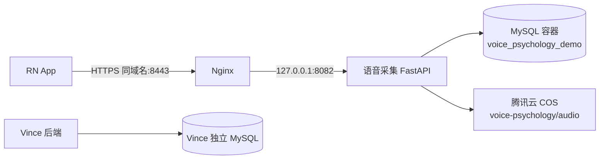

# 语音心理科研采集 App Demo 需求文档

用途：交付 AI 生成可本地运行完整 Demo，技术栈改为 React-Native（RN）+ Python FastAPI 后端；后端接入 DeepSeek API 做心理分析推理。开发阶段支持本地运行；Demo 后端可与现有 Vince 项目共用一台腾讯云服务器，以相同域名和不同端口对外提供服务。原型对标香港理工大学刘焱课题组「医疗语音交互系统」抑郁/人格语音采集子项目。
⚠️两套模式：面试演示模式（默认，伦理合规）、开发者调试模式（本地把玩，调用DeepSeek做推理演示）。Demo为工程原型，非医疗产品，不能用于真实临床诊断。
 
一、项目来龙去脉
 
真实项目背景
 
香港理工大学 · 认知计算实验室（刘焱Yan Liu教授），医疗语音交互系统方向。
 
1. 科研痛点：传统心理学量表（PHQ‑9抑郁、MBTI人格）依靠用户主观答题，多次复测结果不稳定，存在刻意伪装、主观偏差。
2. 科研方案：采集普通人日常说话语音，分析语音声学特征（语速、停顿、语调、能量等），在服务端训练AI模型做心理状态分析。
3. 项目所处阶段：新项目，处于数据采集阶段，无公开Demo、无开源代码、未发表论文。
4. 真实App定位：人体受试者科研采集工具
- 客户端职责：收集知情同意、填写问卷、录制语音、上传音频+问卷元数据到后端。
- 伦理硬性约束：正式版本客户端禁止输出任何AI心理预测结果；全部推理、特征提取放到实验室后端执行；受试者拥有随时删除本人全部数据的权利。
5. 类比参考：工程范式和美团具身智能数采平台高度一致；区别：具身智能采集视频/点云，本项目采集人声语音音频。
 
Demo定位说明
 
1. RN移动端只负责采集交互，所有AI推理全部放在FastAPI后端，客户端不跑大模型；
2. 后端本地调用DeepSeek开放API；音频、问卷数据后端本地持久化；
3. 提供调试开关：开启后，后端调用DeepSeek，返回模拟心理分析结果给到前端展示；面试演示关闭开关，不调用大模型，对齐正式科研产品形态；
4. 整套系统本地部署，RN模拟器 + FastAPI本地服务，不需要公网服务器。
 
二、完整技术栈
 
移动端（React‑Native RN）
 
- React‑Native + TypeScript
- 录音库： react‑native‑audio‑recorder‑player ，录制AAC音频
- 本地存储： AsyncStorage  缓存状态；音频文件保存在手机模拟器沙盒目录
- 网络：axios 请求本地FastAPI后端  http://127.0.0.1:8000 
- UI：可使用react‑native基础组件，不需要复杂UI库
 
后端（Python FastAPI）
 
- FastAPI 提供http接口
- 数据库：MySQL，使用 SQLAlchemy ORM，保存受试者信息、问卷作答、音频文件路径、推理结果
- 文件存储：上传的 AAC 音频保存在后端本地 `./upload_audio` 文件夹；腾讯云部署时该目录应位于受控的持久化磁盘路径
- AI能力：调用 DeepSeek HTTP API，需要读取环境变量 `DEEPSEEK_API_KEY`，密钥写环境变量，禁止硬编码到代码
- 依赖：`fastapi`、`uvicorn`、`sqlalchemy`、`pymysql`、`python-dotenv`、`requests`、`pydantic`
 
⚠️重要：DeepSeek仅后端调用，RN前端完全不直接访问大模型接口。

### 腾讯云部署与 MySQL 方案（已定）

本 Demo 与 Vince 后端共用同一台腾讯云服务器和同一个域名，并采用相同的 Docker Compose + GitHub Actions SSH 发布方式。两个后端服务使用不同的内部监听端口，客户端通过相同域名加不同 HTTPS 端口访问；本 Demo 在独立 Docker Compose 网络内运行专属 MySQL 容器、数据库和账号，不复用 Vince 的业务库或账号。

| 项目 | 部署决策 | 说明与边界 |
| --- | --- | --- |
| 对外地址 | `https://<同一域名>:8443` | 与 Vince 使用相同域名，但使用本 Demo 专属端口；实际端口可调整，需同步更新 RN 的生产环境 API 地址。 |
| FastAPI 服务 | `127.0.0.1:8082` | 仅监听本机回环地址，由 Nginx 转发；不直接暴露 FastAPI 端口到公网。 |
| 反向代理与 TLS | Nginx 监听 `8443` 并转发至 `127.0.0.1:8082` | 同一域名的 HTTPS 证书可用于不同端口；`8443` 需在腾讯云安全组和服务器防火墙中按需放行。 |
| 数据库 | 专属 MySQL 8 容器，库名 `voice_psychology_demo` | 使用账号 `voice_demo_app`；容器仅供本 Demo 的 FastAPI 使用。 |
| MySQL 网络边界 | 仅绑定宿主机 `127.0.0.1:3308` | 容器网络内使用 `mysql:3306`；不开放 MySQL 到公网，也不占用 Vince 的 `3306` 映射。 |
| 音频文件 | 宿主机持久化目录 `data/upload_audio/` | 挂载到 API 容器内 `/app/upload_audio`，容器更新不会清理音频；目录权限、备份、访问日志和删除流程需独立管理。 |
| 自动部署 | GitHub Actions 经 SSH 更新服务器 | 推送 `master` 分支且后端或部署配置变更时，服务器拉取代码并执行 `docker compose -f docker-compose.prod.yml up -d --build`。 |



部署环境通过 `.env` 或部署平台密钥配置提供以下变量，不得提交真实值：

```dotenv
DATABASE_URL=mysql+pymysql://voice_demo_app:<URL编码后的密码>@mysql:3306/voice_psychology_demo?charset=utf8mb4
AUDIO_COS_BUCKET=<COS桶名称>
AUDIO_COS_REGION=ap-shanghai
AUDIO_COS_SECRET_ID=<COS SecretId>
AUDIO_COS_SECRET_KEY=<COS SecretKey>
AUDIO_COS_KEY_PREFIX=voice-psychology
```

GitHub 仓库中不提交 `apps/api/.env`，实际值由部署工作流同步到服务器。工作流沿用 Vince 的 SSH Secrets：`SERVER_HOST`、`SERVER_USER`、`SERVER_SSH_KEY`；实际的 MySQL、COS 与 DeepSeek 配置通过 GitHub Actions 环境变量注入。本期不要求把 MySQL、COS 音频对象或 DeepSeek Key 暴露到公网；正式采集前仍需确认服务器容量、备份与恢复策略、访问控制及科研伦理/数据合规要求。

当前版本不实现 DeepSeek 调用或向客户端返回任何心理分析结果；录音与问卷仅用于科研采集和受控存储。未来如需要接入分析能力，应通过明确的独立需求实现，不能以运行时开关改变当前采集流程。
 
三、完整业务流转
 
plaintext
  

RN App启动
→ Page1：伦理知情同意页（必须勾选同意，否则无法进入）
→ Page2：匿名受试者信息录入
→ Page3：PHQ‑9抑郁量表问卷
→ Page4：简化MBTI问卷
→ Page5：语音录音采集页面（核心页面）
→ RN：录音结束，AAC音频文件 + 问卷全部数据，multipart/form‑data POST上传到本地FastAPI后端
→ FastAPI：将音频上传到腾讯云 COS，问卷/元数据及 COS 对象 Key 写入 MySQL 数据库
→ RN跳转 Page6：记录列表页
→ RN可请求后端接口：查看记录、播放 COS 音频流、查看问卷；支持删除单条/受试者全部数据
 
 
五、RN移动端页面需求
 
Page1 伦理知情同意页面
 
1. 展示精简版高校人体受试者科研知情同意文本；
2. 复选框： 我已经阅读并同意本科研采集协议 ；
3. 按钮【进入实验】：未勾选置灰不可点击；不同意停留在本页面。
 
Page2 受试者信息录入页
 
匿名采集，不收集姓名手机号
 
- 匿名受试者编号（自动生成uuid或手动输入）
- 选择：年龄段、性别
- 点击下一步，数据暂存，下一步填写问卷。
 
Page3 PHQ‑9抑郁量表页面
 
1. PHQ‑9完整9道题，每题0‑4单选；
2. 本地计算问卷原始总分，界面展示问卷原始得分（仅问卷结果，非AI预测）。
 
Page4 简化MBTI问卷页面
 
1. 少量MBTI经典二选一题目；
2. 保存全部选项，仅展示维度计数，不输出人格标签。
 
Page5 语音录音核心页面（Demo重点）
 
1. 展示朗读提示文本，模拟科研采集任务；
2. 请求麦克风权限；权限拒绝提示用户；
3. 按钮：开始录音 / 停止录音；输出AAC压缩音频；
4. 模拟器模拟后台录音逻辑。
 
代码注释（RN侧）
 
ts
  

// ==========生产环境工程痛点==========
// iOS生产需要配置Audio Background Mode；AppStore审核限制无限后台录音
// Android各厂商ROM电池策略会杀死后台录音进程，来电打断录音需要异常处理
// Demo上传音频到本地FastAPI服务；真实项目需要分片、断点续传上传科研服务器
// 伦理约束：正式客户端绝不运行AI推理；全部推理交给后端服务
 
 
5. 录音完成：将音频文件 + 受试者信息 + PHQ9 + MBTI全部作答，multipart表单提交POST到FastAPI上传接口。
 
Page6 记录管理列表页
 
1. 列表展示后端返回记录：受试者编号、采集时间、PHQ‑9问卷原始得分；
2. 每条记录操作：
- 查看完整问卷作答；
- 请求后端音频流，在RN播放录音；
- 删除单条记录（调用后端接口，同时删除磁盘音频文件 + 数据库记录）；
3. 伦理功能按钮：一键删除该受试者全部问卷+全部音频文件
 
注释： // 伦理审查硬性需求：受试者可随时销毁本人全部实验数据 
 
详情页不展示任何 AI 心理分析面板或预测结果。
 
六、FastAPI后端接口清单
 
本地开发环境使用 `http://127.0.0.1:8000`，提供接口文档 `/docs`；腾讯云生产环境使用 `https://<同一域名>:8443`，由 Nginx 转发到 FastAPI 内部端口。
 
1.  POST /api/submit_record 
multipart/form‑data：音频文件、受试者json信息、phq9问卷、mbti问卷
 
- 上传音频到腾讯云 COS，将 COS 对象 Key 与问卷写入 MySQL；
- 不调用 DeepSeek，不生成或返回心理分析结果；
- 返回记录 ID。

 
2.  GET /api/records  获取全部采集记录列表
3.  GET /api/record/{record_id}  获取单条记录详情（问卷、推理结果）
4.  GET /api/audio/{record_id}  返回音频文件流，供RN播放
5.  DELETE /api/record/{record_id}  删除单条记录+对应音频文件
6.  DELETE /api/subject/{subject_id}  删除某个受试者全部记录与音频（伦理接口）
 
后端重要约束
 
1. 当前版本不发起任何 DeepSeek 网络请求，也不提供 AI 心理分析结果；
2. 数据库通过 `DATABASE_URL` 连接 MySQL；生产环境使用独立的 `voice_psychology_demo` 数据库及最小权限账号，禁止将 MySQL `3306` 端口暴露到公网；
3. 音频必须通过受控的 COS 配置上传、读取和删除；
4. 所有异常捕获，返回友好错误给前端。
 
七、项目README.md
 
markdown
  

# RN+FastAPI 语音心理科研采集 Demo
>原型演示项目，模拟高校医疗语音科研受试者采集系统，**仅工程演示，不是医疗产品，不可用于真实诊断**。

## 技术栈
- 移动端：React‑Native + TS；音频录制 react‑native‑audio‑recorder‑player
- 后端：Python FastAPI + SQLAlchemy + MySQL
- AI推理：后端调用 DeepSeek API；**前端不直接访问大模型**

## 环境准备
1. 后端
复制`.env.example`为`.env`，填入你的 `DEEPSEEK_API_KEY=sk‑xxx`
```bash
pip install -r requirements.txt
# .env 中配置 DATABASE_URL 和 DEEPSEEK_API_KEY
uvicorn main:app --reload
# 接口文档访问 http://127.0.0.1:8000/docs
 
 
2. React‑Native端
 
bash
  

npm install
npx react‑native run‑android 或 run‑ios模拟器
# 修改axios后端地址指向本机 127.0.0.1:8000
 
 
⚠️安卓模拟器访问本机后端用  10.0.2.2:8000 
 
业务流程
 
知情同意 → 匿名受试者信息 → PHQ‑9问卷 → MBTI问卷 → 录音采集 → 上传音频&问卷到FastAPI后端 → 记录管理查看/播放/删除。
 
心理分析说明

当前版本只完成问卷与录音的科研采集、存储、播放和伦理删除闭环；不调用 DeepSeek，也不向客户端输出心理预测或人格标签。
 
Demo与真实科研项目差异
 
1. 真实项目：会提取语音声学特征送入自研模型，而不是直接丢问卷给通用大模型；
2. 真实项目：需要音频分片断点续传、受控的远端科研存储和完整高校伦理审查；本 Demo 当前可本地运行，也可部署到腾讯云服务器；
3. 真实项目：AI推理运行后端，但不会在客户端向受试者展示心理预测结果；
4. DeepSeek调用仅Demo演示闭环，正式科研版本该逻辑移除，替换为实验室自研AI模型。
 
plaintext
  


## 八、面试配套口述脚本
>这个Demo采用React‑Native + FastAPI架构，模仿课题组医疗语音采集项目完整链路。
>移动端只负责采集知情同意、心理问卷和麦克风录音，把音频和问卷全部上传到本地FastAPI后端。所有AI推理全部放在后端执行，前端不调用任何大模型。
>后端当前只存储采集数据，不调用 DeepSeek，客户端不展示心理预测；这与科研采集阶段的伦理边界一致。
>项目复现了移动端录音权限、音频上传、后端持久化存储，还有伦理要求的受试者一键删除全部数据。真实项目会把通用大模型替换为语音声学特征训练出来的自研模型。

## 九、强制约束（给AI生成代码）
1. 当前版本不应发起向 DeepSeek 的网络请求，也不应向客户端返回心理预测；
2. Demo 不做语音信号特征提取；真实科研需要通过声学特征与经验证模型完成后续研究分析；
3. 删除接口必须同时清理数据库记录与对应 COS 音频对象；
4. 安卓模拟器访问本机后端注意使用特殊 IP `10.0.2.2`，代码中做注释提示。
